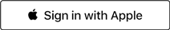

# vue-apple-login
> A simple [Vue](https://vuejs.org) plugin to include an [Apple sign-in button](https://developer.apple.com/documentation/signinwithapplejs) into your web app.




## Install
```
npm install vue-apple-login
```

## Usage

index.html
``` html
<script type="text/javascript" src="https://appleid.cdn-apple.com/appleauth/static/jsapi/appleid/1/en_US/appleid.auth.js"></script>
```

main.js
``` js
import VueAppleLogin from 'vue-apple-login';

Vue.use(VueAppleSignin, {
  clientId: 'com.example.signin',
  scope: 'name email',
  redirectURI: 'https://example.com',
  state: time.toString(),
  usePopup: true,
});
```
Now you have a `vue-apple-login` global component, ready for use.

## Example
### Simple
``` html
<vue-apple-login></vue-apple-login>
```

### Advanced
``` html
<vue-apple-login
  mode="center-align"
  type="sign in"
  color="black"
  :border="true"
  :radius="15"
  width="100%"
  height="100%"
  logoSize="medium"
  :logoPosition="0"
  :labelPosition="0"
  className="vue-apple-login"
  :onSuccess="callSuccess"
  :onFailure="callFail"
></vue-apple-login>
```
For more information on styling visit: [Apple documentation](https://developer.apple.com/documentation/sign_in_with_apple/sign_in_with_apple_js/displaying_sign_in_with_apple_buttons)

`:onSuccess` can be used as callback function to retrieve Apple user data and code to run a 
validation check with the server.
`:onFailure` will be called when authentication failed.
**Make sure `usePopup` is set to `true` for callback to work.**

On a succesfull login you we get the following data
```json
{
  "authorization": {
    "code": "[code to verify user with apple server]",
    "id_token": "[json base64 encode user data]",
    "state": "[random unique number]"
  },
  "userData": {
      "aud": "com.example.signin", 
      "auth_time": 1615125205, 
      "c_hash": "",
      "exp": 1615211605,
      "iat": 1615125205,
      "iss": "https://appleid.apple.com",
      "nonce_supported": true,
      "sub": "[Unique user ID]"
  }
}
```

### Full example
AppleLogin.vue
``` html
<template>
  <div>
    <vue-apple-login v-if="!signedIn"
        color="black"
        :border="true"
        type="sign in"
        width="200"
        height="36"
        :onSuccess="onSuccess"
        :onFailure="onFailure"
    ></vue-apple-login>
    <button v-if="signedIn v-on:click="onSuccessLogout()" class="login-button">
      Sign out with Apple
    </button>
  </div>
</template>

<script>
    export default {
        data() {
            return {
                signedIn: false,
            }
        },
        methods: {
            onSuccess(data) {
                console.log(data);
                this.signedIn = true;
            },
            onSuccessLogout(){
                this.signedIn = false;
            },
            onFailure(error) {
                console.log(error);
            },
        }
    }
</script>

<style scoped>
    button.login-button {
      background-color: white;
      height: 32px;
      width: 200px;
      border-radius: 5px;
      border: 0px;
      font-size: 12px;
      font-weight: 500;
      margin: 5px;
    }
    button.login-button svg{
      height: 15px;
      margin-top: -3px;
      margin-right: 3px;
    }
</style>
```


